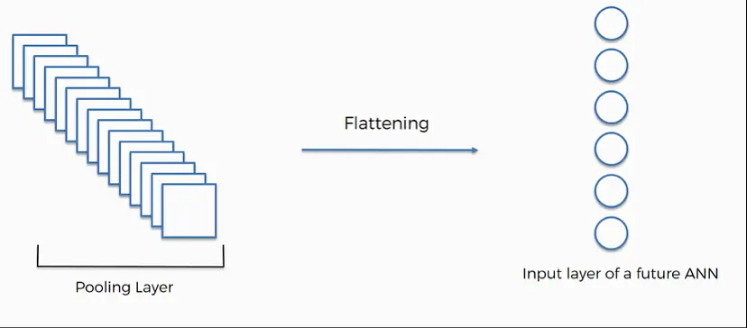
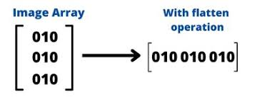
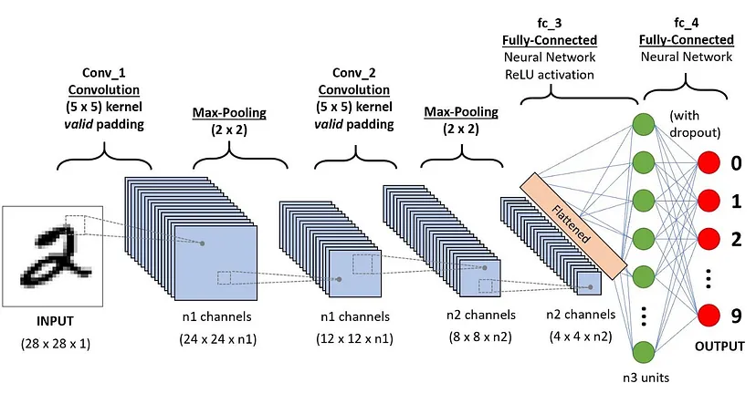
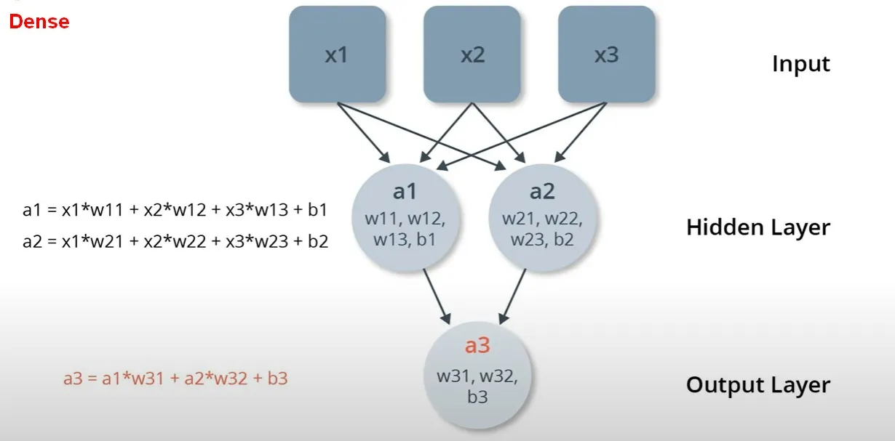
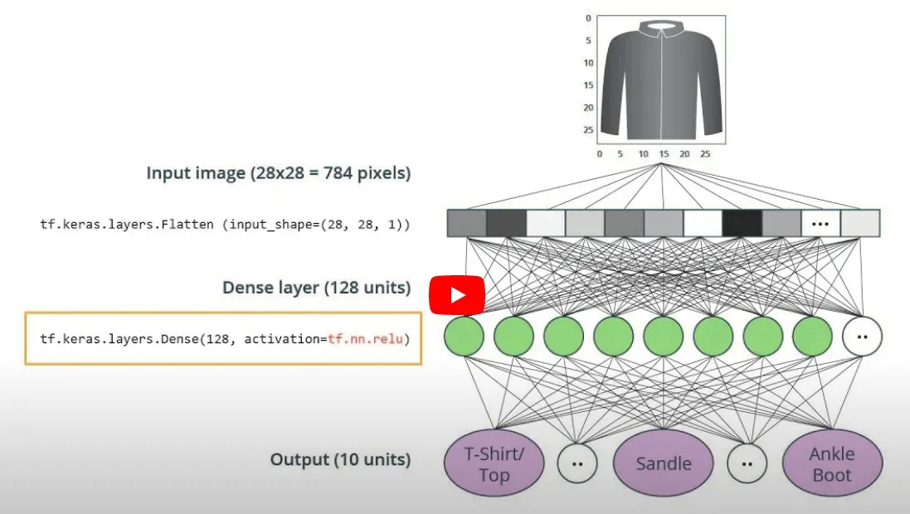

- [隨機梯度](http://zh.gluon.ai/chapter_optimization/gd-sgd.html)
- [dense](https://keras-cn.readthedocs.io/en/latest/layers/core_layer/)
- [mnist](https://sweetornotspicymarathon.medium.com/tesorflow-keras-%E5%AD%B8%E7%BF%92%E7%AD%86%E8%A8%98-%E6%96%B0%E6%89%8B%E4%B8%80%E5%AE%9A%E8%A6%81%E7%8E%A9%E7%9A%84mnist%E6%89%8B%E5%AF%AB%E6%95%B8%E5%AD%97%E8%BE%A8%E8%AD%98-9327366cc838) 
  每一張圖片為 28*28大小，這個數據庫當中包含60000筆訓練影像和10000筆測試影像

## flattern vs dense

### 以CNN為[例](https://medium.com/@vaibhav1403/flattening-in-neural-network-10e260d2b06f)
1. Structure of CNNs:
  CNNs usually have a series of convolutional layers followed by pooling layers. These layers produce multi-dimensional outputs known as feature maps.
  To connect these feature maps to the fully connected layers (which are regular neural network layers with no spatial dimensions), we need to reshape or “flatten” these maps.
1. Flatten Operation:
  Suppose the output of your final pooling layer is a 3D tensor of shape (height, width, depth). The flatten operation will reshape this 3D tensor into a 1D tensor (vector) of shape (height * width * depth,).
  For instance, if you have a 6x6 feature map with 64 channels (6x6x64 tensor), after flattening, you’d get a vector of 2,304 elements.
1. Purpose:
  The main reason for flattening is to prepare the data for the dense layers of the network. Dense layers require their input data in a flattened form, as they don’t work with the 2D spatial dimensions inherent in the feature maps.
  After flattening, you often have one or more dense layers which perform the final computations and produce the output, whether it be a classification score, regression output, etc.
1. Visualization:
  Imagine you have a stack of feature maps, each one like a 2D grid of values. Flattening is like taking each of these grids, lining them up, and stringing them end-to-end into a long ribbon or vector.
1. Note:
  While flattening is a common practice in many classic CNN architectures, some modern architectures utilize global average pooling or other techniques to transition from spatial layers to dense layers without explicitly flattening.
  In essence, flattening is the simple process of reshaping multi-dimensional data into a vector, making it compatible with fully connected layers in a neural network.





Dense層是使用線性代數裡的矩陣運算概念實現的。

具體地說，Dense層的計算過程包括了對輸入和前一層輸出的矩陣乘法，以及對輸入和輸出的加權和。 這個綜合計算可以用下面這個矩陣的形式來表示

y = W*x + b

其中 y 是 Dense 層的輸出，x 是輸入，W 是 Dense 層的權重矩陣， b 是偏差項。

這個運算滿足矩陣乘法的性質， W 可以看成是一個 m x n 的矩陣， x 是一個 n x 1 的向量, 這樣 y 就是一個 m x 1 的向量，就是輸出。這種運算方式可以幫助網絡在運算過程中組合特徵，輸出高維度且有用的特徵。
  

```python
import tensorflow as tf
# Import TensorFlow Datasets
import tensorflow_datasets as tfds
tfds.disable_progress_bar()
 
# Helper libraries
import math
import numpy as np
import matplotlib.pyplot as plt
import logging
logger = tf.get_logger()
logger.setLevel(logging.ERROR)
dataset, metadata = tfds.load('fashion_mnist', as_supervised=True, with_info=True)
train_dataset, test_dataset = dataset['train'], dataset['test']
class_names = metadata.features['label'].names
print("Class names: {}".format(class_names))
num_train_examples = metadata.splits['train'].num_examples
num_test_examples = metadata.splits['test'].num_examples
print("Number of training examples: {}".format(num_train_examples))
print("Number of test examples:     {}".format(num_test_examples))
def normalize(images, labels):
  images = tf.cast(images, tf.float32) # 整數轉浮點
  images /= 255
  return images, labels
 
# The map function applies the normalize function to each element in the train
# and test datasets 函數normalize 應用到每筆資料
train_dataset =  train_dataset.map(normalize)
test_dataset  =  test_dataset.map(normalize)
 
# The first time you use the dataset, the images will be loaded from disk
# Caching will keep them in memory, making training faster
train_dataset =  train_dataset.cache()
test_dataset  =  test_dataset.cache()
# Take a single image, and remove the color dimension by reshaping
for image, label in test_dataset.take(1):
  break
image = image.numpy().reshape((28,28))
 
model = tf.keras.Sequential([
    tf.keras.layers.Flatten(input_shape=(28, 28, 1)),
    tf.keras.layers.Dense(128, activation=tf.nn.relu),
    tf.keras.layers.Dense(10, activation=tf.nn.softmax)
])
#如果目標是one-hot 編碼，比如二分類【0,1】【1,0】，損失函數用 categorical_crossentropy。 如果目標是數字編碼 ，比如二分類0,1，損失函數用 sparse_categorical_crossentropy。
model.compile(optimizer='adam',
              loss=tf.keras.losses.SparseCategoricalCrossentropy(),
              metrics=['accuracy'])
BATCH_SIZE = 32
train_dataset = train_dataset.cache().repeat().shuffle(num_train_examples).batch(BATCH_SIZE)
test_dataset = test_dataset.cache().batch(BATCH_SIZE)
model.fit(train_dataset, epochs=5, steps_per_epoch=math.ceil(num_train_examples/BATCH_SIZE))
 
test_loss, test_accuracy = model.evaluate(test_dataset, steps=math.ceil(num_test_examples/32))
print('Accuracy on test dataset:', test_accuracy)
 
for test_images, test_labels in test_dataset.take(1):
  test_images = test_images.numpy()
  test_labels = test_labels.numpy()
  predictions = model.predict(test_images)
np.argmax(predictions[0])
```

程式參考
- [tfdataset](https://www.scaler.com/topics/tensorflow/data-pipelines-with-tensorflow-data-services/)

Training loop - eager execution
```python
optimizer = tf.train. MomentumOptimizer(...)
for (x, y) in dataset make_one_shot_iterator(): 
  with tf.GradientTape() as g:
    y_ = model(x)
    loss=loss_fn(y, y_)
  grads= g.gradient (y_, model variables)
  optimizer.apply_gradients (zip (grads, model variables))
```


