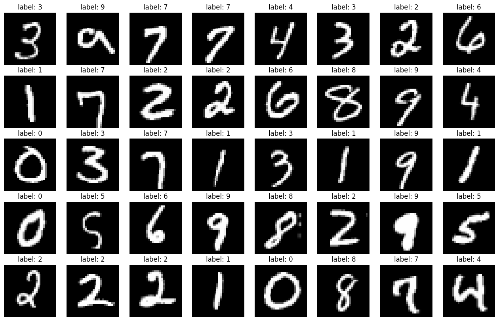
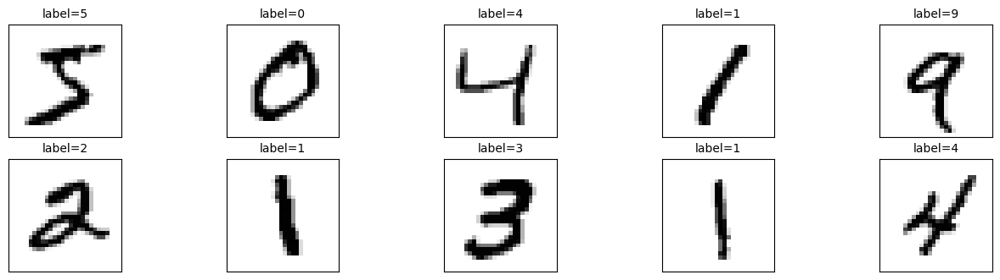

[mnist](https://sweetornotspicymarathon.medium.com/tesorflow-keras-%E5%AD%B8%E7%BF%92%E7%AD%86%E8%A8%98-%E6%96%B0%E6%89%8B%E4%B8%80%E5%AE%9A%E8%A6%81%E7%8E%A9%E7%9A%84mnist%E6%89%8B%E5%AF%AB%E6%95%B8%E5%AD%97%E8%BE%A8%E8%AD%98-9327366cc838) 
  每一張圖片為 28*28大小，這個數據庫當中包含60000筆訓練影像和10000筆測試影像


```python

import matplotlib.pyplot as plt
from keras.datasets import mnist
import numpy as np 
import pandas as pd 
```


```python

#from keras.utils import np_utils
np.random.seed(10)

# 匯入資料

(x_train_image,y_train_label),(x_test_image,y_test_label)=mnist.load_data()

print(x_train_image[0,0]) #每一張圖片為 28*28大小 這裡是第一個row 有28個元素
print(x_train_image[0]) #每一張圖片為 28*28大小
print('train data= ',len(x_train_image))
print('test data=', len(x_test_image))

```

    [0 0 0 0 0 0 0 0 0 0 0 0 0 0 0 0 0 0 0 0 0 0 0 0 0 0 0 0]
    [[  0   0   0   0   0   0   0   0   0   0   0   0   0   0   0   0   0   0
        0   0   0   0   0   0   0   0   0   0]
     [  0   0   0   0   0   0   0   0   0   0   0   0   0   0   0   0   0   0
        0   0   0   0   0   0   0   0   0   0]
     [  0   0   0   0   0   0   0   0   0   0   0   0   0   0   0   0   0   0
        0   0   0   0   0   0   0   0   0   0]
     [  0   0   0   0   0   0   0   0   0   0   0   0   0   0   0   0   0   0
        0   0   0   0   0   0   0   0   0   0]
     [  0   0   0   0   0   0   0   0   0   0   0   0   0   0   0   0   0   0
        0   0   0   0   0   0   0   0   0   0]
     [  0   0   0   0   0   0   0   0   0   0   0   0   3  18  18  18 126 136
      175  26 166 255 247 127   0   0   0   0]
     [  0   0   0   0   0   0   0   0  30  36  94 154 170 253 253 253 253 253
      225 172 253 242 195  64   0   0   0   0]
     [  0   0   0   0   0   0   0  49 238 253 253 253 253 253 253 253 253 251
       93  82  82  56  39   0   0   0   0   0]
     [  0   0   0   0   0   0   0  18 219 253 253 253 253 253 198 182 247 241
        0   0   0   0   0   0   0   0   0   0]
     [  0   0   0   0   0   0   0   0  80 156 107 253 253 205  11   0  43 154
        0   0   0   0   0   0   0   0   0   0]
     [  0   0   0   0   0   0   0   0   0  14   1 154 253  90   0   0   0   0
        0   0   0   0   0   0   0   0   0   0]
     [  0   0   0   0   0   0   0   0   0   0   0 139 253 190   2   0   0   0
        0   0   0   0   0   0   0   0   0   0]
     [  0   0   0   0   0   0   0   0   0   0   0  11 190 253  70   0   0   0
        0   0   0   0   0   0   0   0   0   0]
     [  0   0   0   0   0   0   0   0   0   0   0   0  35 241 225 160 108   1
        0   0   0   0   0   0   0   0   0   0]
     [  0   0   0   0   0   0   0   0   0   0   0   0   0  81 240 253 253 119
       25   0   0   0   0   0   0   0   0   0]
     [  0   0   0   0   0   0   0   0   0   0   0   0   0   0  45 186 253 253
      150  27   0   0   0   0   0   0   0   0]
     [  0   0   0   0   0   0   0   0   0   0   0   0   0   0   0  16  93 252
      253 187   0   0   0   0   0   0   0   0]
     [  0   0   0   0   0   0   0   0   0   0   0   0   0   0   0   0   0 249
      253 249  64   0   0   0   0   0   0   0]
     [  0   0   0   0   0   0   0   0   0   0   0   0   0   0  46 130 183 253
      253 207   2   0   0   0   0   0   0   0]
     [  0   0   0   0   0   0   0   0   0   0   0   0  39 148 229 253 253 253
      250 182   0   0   0   0   0   0   0   0]
     [  0   0   0   0   0   0   0   0   0   0  24 114 221 253 253 253 253 201
       78   0   0   0   0   0   0   0   0   0]
     [  0   0   0   0   0   0   0   0  23  66 213 253 253 253 253 198  81   2
        0   0   0   0   0   0   0   0   0   0]
     [  0   0   0   0   0   0  18 171 219 253 253 253 253 195  80   9   0   0
        0   0   0   0   0   0   0   0   0   0]
     [  0   0   0   0  55 172 226 253 253 253 253 244 133  11   0   0   0   0
        0   0   0   0   0   0   0   0   0   0]
     [  0   0   0   0 136 253 253 253 212 135 132  16   0   0   0   0   0   0
        0   0   0   0   0   0   0   0   0   0]
     [  0   0   0   0   0   0   0   0   0   0   0   0   0   0   0   0   0   0
        0   0   0   0   0   0   0   0   0   0]
     [  0   0   0   0   0   0   0   0   0   0   0   0   0   0   0   0   0   0
        0   0   0   0   0   0   0   0   0   0]
     [  0   0   0   0   0   0   0   0   0   0   0   0   0   0   0   0   0   0
        0   0   0   0   0   0   0   0   0   0]]
    train data=  60000
    test data= 10000
    


```python
from random import randrange

plt.figure(figsize=(16,10),facecolor='w')
for i in range(5):
  for j in range(8):
    index = randrange(0, 60000)
    plt.subplot(5, 8, i*8+j+1)
    plt.title("label: {}".format(y_train_label[index]))
    plt.imshow(x_train_image[index], plt.cm.gray)
    plt.axis('off')

plt.show()
```


    

    


```python
# 建立函數要來畫多圖的
def plot_images_labels_prediction(images,labels,prediction,idx,num=10): 
  
  # 設定顯示圖形的大小
  # fig= plt.gcf()
  # fig.set_size_inches(12,14)
  plt.figure(figsize=(16,10),facecolor='w')
  # 最多25張
  if num>25:num=25

  # 一張一張畫
  for i in range(0,num):

    # 建立子圖形5*5(五行五列)
    ax=plt.subplot(5,5,i+1)

    # 畫出子圖形
    ax.imshow(images[idx],cmap='binary')

    # 標題和label
    title="label=" +str(labels[idx])

    # 如果有傳入預測結果也顯示
    if len(prediction)>0:
      title+=",predict="+str(prediction[idx])

    # 設定子圖形的標題大小
    ax.set_title(title,fontsize=10)

    # 設定不顯示刻度
    ax.set_xticks([]);ax.set_yticks([])  
    idx+=1
  plt.show()  
  
plot_images_labels_prediction(x_train_image,y_train_label,[],0,10)
```


    

    

